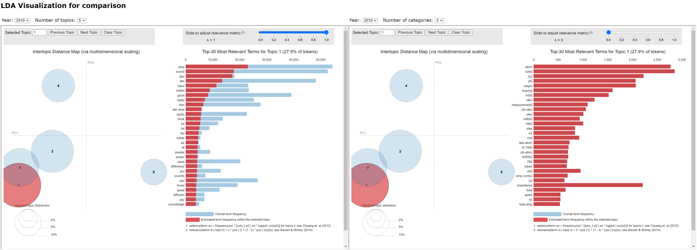
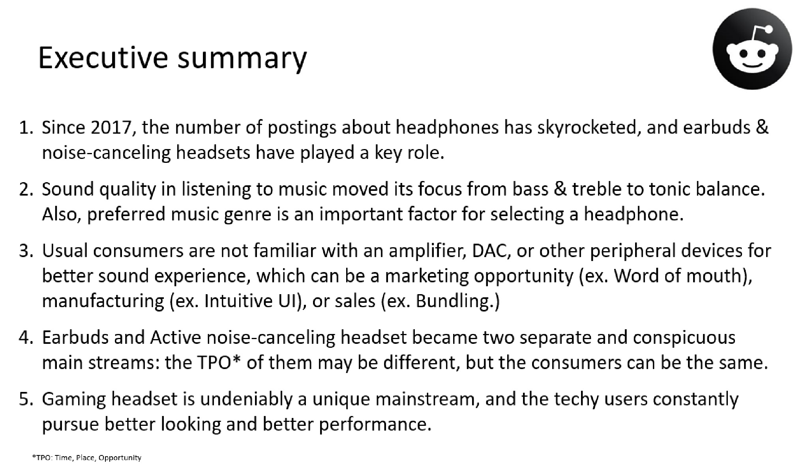

# Reading trends of headphones using Reddit postings
---

## Table of Contents
- [1 Directory Structure](#1-Directory-Structure)<br>
- [2 Project Outline / Problem Statement](#2-Project-Outline-/-Problem-Statement)<br>
- [3 Description of Data](#3-Description-of-Data)<br>
 - [Size](#Size)<br>
 - [Data Dictionary](#Data-Dictionary)<br>
- [4 Data Visualization](#4-Data-Visualization)<br>
- [5 Conclusion](#5-Conclusion)<br>
- [6 Next Steps](#6-Next-Steps)<br>
- [7 Outside Sources](#7-Outside-Sources)<br>


---
## 1 Directory Structure

```
└── nlp_headphone
    ├── code
        ├── scraping_reddit.ipynb
        ├── EDA.ipynb
        ├── LDA.ipynb
        └── LDA_yearly.ipynb
    ├── data
        ├── HeadphoneAdvice.csv
        ├── HeadphoneAdvice_cmt.csv
        ├── headphones.csv
        └── headphones_cmt.csv
    ├── LDA_Pointer
        └── LDA_Pointer.py
    ├── templates
        ├── main.html
        └── ldavis_prepared.html
    └── README.md
```
---
## 2 Project Outline / Problem Statement

Reading trends is vital for most companies. Can we read trends by analyzing Reddit postings that we casually come across? Here comes the answer. By NLP(Natural Language Processing) using the LDA(Latent Dirichlet Allocation) library in Python, I could find trends and product insights based on Reddit posts of headphones.

---
## 3 Description of Data

### Size
- 209 MB

### Data Dictionary
|Dataset|Feature|Type|Description|
|---|---|---|---|
|HeadphoneAdvice.csv, HeadphoneAdvice_cmt.csv, headphones.csv, headphones_cmt.csv | subreddit | object | name of subreddit |
|HeadphoneAdvice.csv, HeadphoneAdvice_cmt.csv, headphones.csv, headphones_cmt.csv | created_utc | int64 | created time |
|HeadphoneAdvice.csv, HeadphoneAdvice_cmt.csv, headphones.csv, headphones_cmt.csv | body | object | contents of reddit postings |
|HeadphoneAdvice.csv, HeadphoneAdvice_cmt.csv, headphones.csv, headphones_cmt.csv | score | int64 | score of postings or comments |

---

## 4 Data Visualization


---
## 5 Conclusion


---
## 6 Next Steps

- Sales data, consumer behavior research, specifications of products, etc. will lead to more in-depth analysis and insights.

---
## 7 Outside Sources

- https://www.reddit.com/r/headphones/
- https://www.reddit.com/r/HeadphoneAdvice/


```

```
